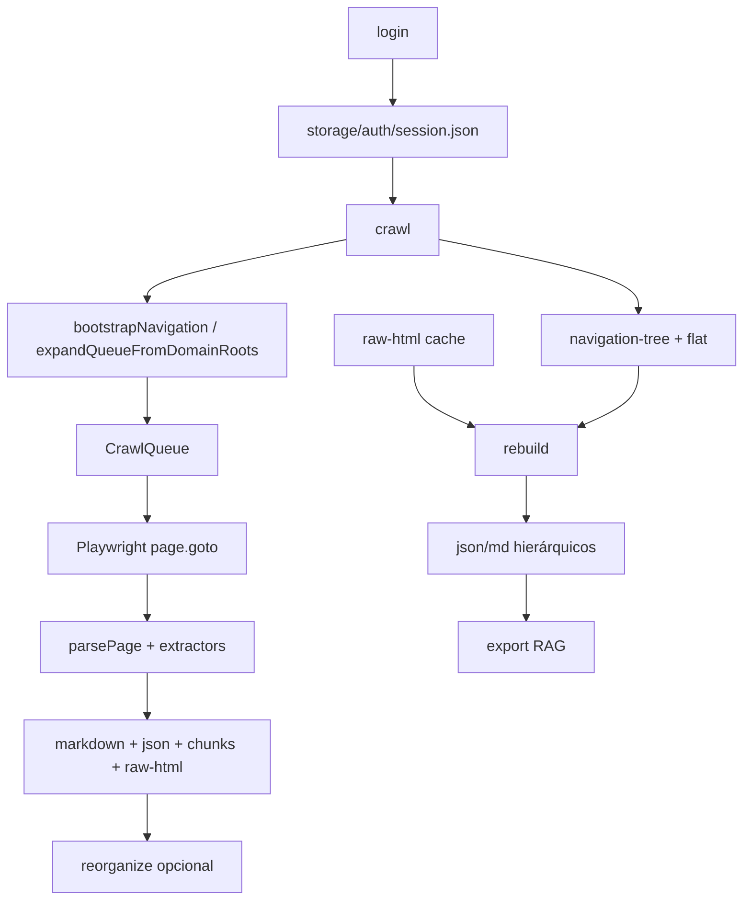

# Arquitetura

## Fluxo principal

## Módulos (`src/`)

### `auth/`
- `login.ts`, `auth-manager.ts`, `session.ts`, `browser.ts`
- CDP para WSL; import de `storageState`.

### `crawler/`
- `crawler.ts` — orquestrador; salva incrementalmente; merge nav em `expandQueueFromDomainRoots`.
- `queue.ts` — fila persistida em `storage/navigation/crawl-queue.json`.
- `discovery.ts` — URLs da sidebar vs full.
- `navigation-parser.ts` — expand sidebar, parse HTML.

### `extractors/`
- `html-extractor.ts` — conteúdo principal, breadcrumbs.
- `sidebar-extractor.ts` — árvore + `flat` com `navPath` / `pathTitles`.
- `endpoint-extractor.ts` — method, path, params (limitado pelo DOM).
- `openapi-extractor.ts`, `graphql-extractor.ts` — interceptação de rede.

### `parsers/`
- `semantic-parser.ts` — monta `SemanticDocument`.
- `domain-parser.ts`, `hierarchy-parser.ts`, `chunk-parser.ts`, `markdown-parser.ts`.

### `navigation/` (novo)
- `nav-harvester.ts` — visita `/v1-*/reference` e colhe sidebar.
- `nav-merge.ts` — merge árvores; `wrapSidebarUnderDomain`.
- `nav-path.ts` — `resolveStorageLocation`, filenames.

### `organizers/` (novo)
- `storage-organizer.ts` — comando `reorganize`.
- `cache-rebuilder.ts` — comando `rebuild` a partir de `raw-html`.

### `exporters/`
- `json-exporter.ts`, `markdown-exporter.ts` — usam `storageSegments` + paths hierárquicos.
- `navigation-exporter.ts`, `summary-exporter.ts`, `rag-exporter.ts`.

### `loaders/`
- `document-loader.ts` — walk recursivo em `storage/json`; hydrate `id`/`markdown`.

## Tipos centrais

- `SemanticDocument` — `src/types/document.ts` (+ `storageSegments?`)
- `FlatNavItem` — `navPath`, `pathTitles` em `src/types/navigation.ts`
- `EndpointDefinition` — `src/types/endpoint.ts`

## Configuração

- `src/config/env.ts` — Zod, sem SMTP ainda.
- `src/config/selectors.ts` — seletores ReadMe (`.rm-Sidebar`, `.rm-Article`).
- `.env.example` — template; usuário mantém `.env` local.

## CLI (`src/index.ts`)

| Comando | Descrição |
|---------|-----------|
| `login` | Autenticação |
| `doctor` | Diagnóstico WSL/CDP |
| `crawl` | Extração completa |
| `reorganize` | Sidebar + mover JSON/MD |
| `rebuild` | Reparse `raw-html` |
| `export` | RAG |
| `clean` | Limpa storage (opcional `--keep-auth`) |
