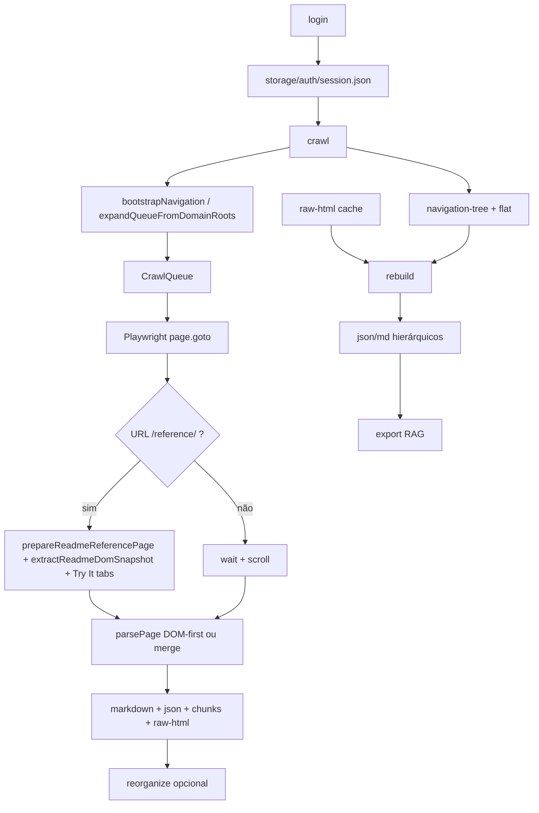

# Arquitetura

## Fluxo principal

## Páginas ReadMe `/reference/` (Dock)

1. **`networkidle`** + preparação: expandir acordeões, esperar hidratação dos blocos de parâmetros.
2. **`extractReadmeDomSnapshot`** — um `page.evaluate` no contexto do browser: headings resilientes, container por seção (evita leakage), `isActuallyVisible`, params/responses, HTML de debug opcional.
3. **`collectTryItLanguageSamples`** — clica abas, faz poll do `pre` visível, hash do snippet.
4. **`parsePage`** — se `readmeDom` tem `method`+`path` e `source === playwright-dom`: **`buildEndpointDefinitionFromReadmeDom`** (sem `extractEndpoint` Cheerio para o mesmo endpoint); senão merge legado.
5. **`enrichDocument`** — título, sanitize, `extractionQuality`, **`qualityScore`** ponderado, `extractionSignals` preservados.

O comando **`rebuild`** só relê `raw-html` com Cheerio: não reproduz tabs nem DOM vivo. Para JSON “rico” igual ao crawl, **re-crawl** das URLs de reference.

## Módulos (`src/`)

### `auth/`
- `login.ts`, `auth-manager.ts`, `session.ts`, `browser.ts`
- CDP para WSL; import de `storageState`.

### `crawler/`
- `crawler.ts` — orquestrador; ramo DOM-first para `/reference/`; métricas em `captureMeta`; debug opcional.
- `queue.ts` — fila persistida em `storage/navigation/crawl-queue.json`.
- `discovery.ts` — URLs da sidebar vs full.
- `navigation-parser.ts` — expand sidebar, parse HTML.

### `extractors/`
- `html-extractor.ts` — conteúdo principal, breadcrumbs.
- `sidebar-extractor.ts` — árvore + `flat` com `navPath` / `pathTitles`.
- `endpoint-extractor.ts` — fallback Cheerio quando não há snapshot DOM completo.
- **`readme-dom-extractor.ts`** — snapshot vivo ReadMe + debug granular.
- **`readme-endpoint-from-dom.ts`** — `EndpointDefinition` só a partir do snapshot.
- **`readme-dom-assertions.ts`** — violações se seção visível e lista vazia.
- `openapi-extractor.ts`, `graphql-extractor.ts` — interceptação de rede.

### `parsers/`
- `semantic-parser.ts` — monta `SemanticDocument`; ramo DOM-first; `exampleType` em blocos de código.
- `domain-parser.ts`, `hierarchy-parser.ts`, `chunk-parser.ts`, `markdown-parser.ts`.

### `navigation/`
- `nav-merge.ts` — merge árvores; `wrapSidebarUnderDomain`.
- `nav-path.ts` — `resolveStorageLocation`, filenames.

### `organizers/`
- `storage-organizer.ts` — comando `reorganize`.
- `cache-rebuilder.ts` — comando `rebuild` a partir de `raw-html`.

### `exporters/`
- `json-exporter.ts`, `markdown-exporter.ts` — `storageSegments` + paths hierárquicos; `extractionSignals` / `extractionQuality` no JSON.
- `navigation-exporter.ts`, `summary-exporter.ts`, `rag-exporter.ts`.

### `quality/`
- `document-enricher.ts` — título, sanitize, qualidade legada + score ponderado.
- `weighted-quality-score.ts` — `excellent` … `broken`.

### `loaders/`
- `document-loader.ts` — walk recursivo em `storage/json`; hydrate `id`/`markdown`.

## Tipos centrais

- `SemanticDocument` — `src/types/document.ts` (`extractionSignals.qualityScore`, `CodeBlock.exampleType`)
- `ReadmeDomSnapshot` — `src/types/readme-dom.ts`
- `FlatNavItem` — `navPath`, `pathTitles` em `src/types/navigation.ts`
- `EndpointDefinition` — `src/types/endpoint.ts`

## Configuração

- `src/config/env.ts` — Zod.
- `.env.example` — template; inclui `EXTRACTION_DEBUG_ARTIFACTS`.

## CLI (`src/index.ts`)

| Comando | Descrição |
|---------|-----------|
| `login` | Autenticação |
| `doctor` | Diagnóstico WSL/CDP |
| `crawl` | Extração completa (DOM-first em reference) |
| `reorganize` | Sidebar + mover JSON/MD |
| `rebuild` | Reparse `raw-html` (sem DOM vivo) |
| `export` | RAG |
| `audit` | Relatório de qualidade |
| `test` | `tsx --test` (unitários) |
| `clean` | Limpa storage (opcional `--keep-auth`) |
